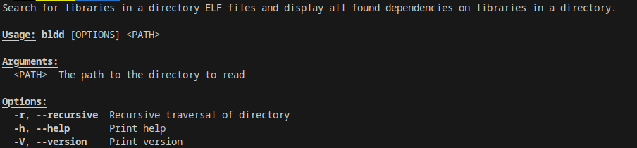

Backward ldd
=======


All ELF files contain data about libraries used by the program, therefore such as ***ldd***, ***readelf*** etc. bash commands exist, which parse an ELF dynamic table to find used shared libraries.  
The bldd works with directories and collects the **readelf** command output to make a **list** of all lib names and files used a lib and the machine architecture from an ELF file header.

_____

____

Usage example:
---
Input:


```
./bldd .
```
Output:
````


---------- x86_64 ----------
  libgcc_s.so.1 (1 executables) ->
    ./bldd

  libc.so.6 (1 executables) ->
    ./bldd

  ld-linux-x86-64.so.2 (1 executables) ->
    ./bldd

````
Input:
```
./bldd -r .
```

Output:

```
---------- x86_64 ----------
  libgcc_s.so.1 (34 executables) ->
    ./bldd
    ./build/num-traits-cfc12ef6a2206e39/buildk-script-build
    ./build/num-traits-cfc12ef6a2206e39/build_script_build-cfc12ef6a2206e39
    ./build/libc-61aecf2398dbde23/build_script_build-61aecf2398dbde23
    ./build/libc-61aecf2398dbde23/build-script-build
    ./build/proc-macro-error-attr-8dda783b6edd3f20/build-script-build
    .......
  libc.so.6 (34 executables) ->
    ./bldd
    ./build/num-traits-cfc12ef6a2206e39/build-script-build
    ./build/num-traits-cfc12ef6a2206e39/build_script_build-cfc12ef6a2206e39
    ./build/libc-61aecf2398dbde23/build_script_build-61aecf2398dbde23
    ./build/libc-61aecf2398dbde23/build-script-build
    ./build/proc-macro-error-attr-8dda783b6edd3f20/build-script-build
    .......
```


