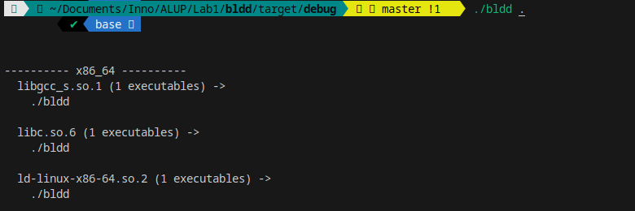
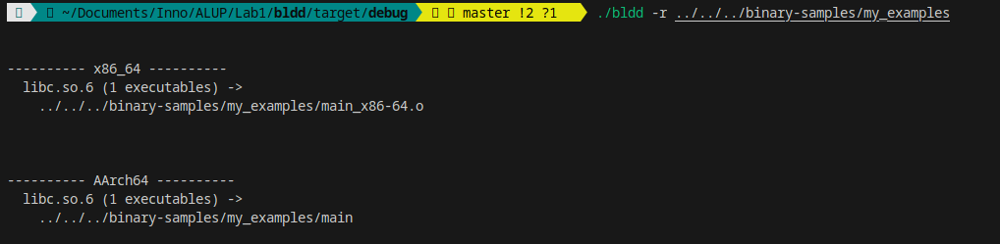
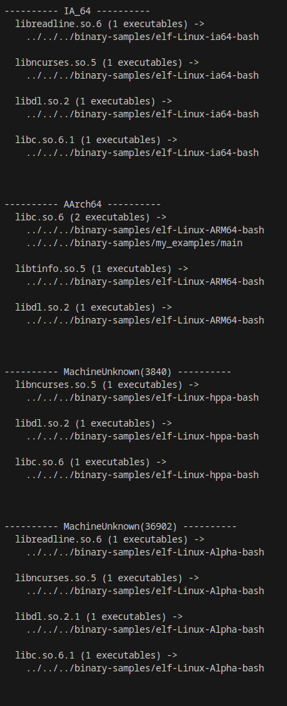
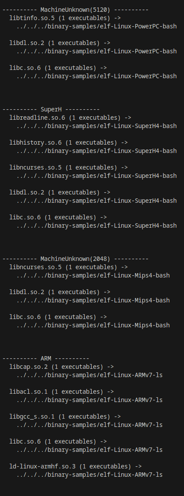

Backward ldd
=======


All ELF files contain data about libraries used by the program, therefore such as ***ldd***, ***readelf*** etc. bash commands exist, which parse an ELF dynamic table to find used shared libraries.  
The bldd works with directories and collects the **readelf** command output to make a **list** of all lib names and files used a lib and the machine architecture from an ELF file header.

_____

____

Usage example:
---
Input:
Non-recursive option

```
./bldd .
```
Output:
````


---------- x86_64 ----------
  libgcc_s.so.1 (1 executables) ->
    ./bldd

  libc.so.6 (1 executables) ->
    ./bldd

  ld-linux-x86-64.so.2 (1 executables) ->
    ./bldd

````


Input:
Recursive option:
```
./bldd -r .
```

Output:

```
---------- x86_64 ----------
  libgcc_s.so.1 (34 executables) ->
    ./bldd
    ./build/num-traits-cfc12ef6a2206e39/buildk-script-build
    ./build/num-traits-cfc12ef6a2206e39/build_script_build-cfc12ef6a2206e39
    ./build/libc-61aecf2398dbde23/build_script_build-61aecf2398dbde23
    ./build/libc-61aecf2398dbde23/build-script-build
    ./build/proc-macro-error-attr-8dda783b6edd3f20/build-script-build
    .......
  libc.so.6 (34 executables) ->
    ./bldd
    ./build/num-traits-cfc12ef6a2206e39/build-script-build
    ./build/num-traits-cfc12ef6a2206e39/build_script_build-cfc12ef6a2206e39
    ./build/libc-61aecf2398dbde23/build_script_build-61aecf2398dbde23
    ./build/libc-61aecf2398dbde23/build-script-build
    ./build/proc-macro-error-attr-8dda783b6edd3f20/build-script-build
    .......
```

______
The code explanation:
-
Used libraries:
----
***elf_rs*** - used to get the version of machine architecture from ELF files (I'm lazy to describe mapping from hex to string for all of them, but I added in here around 5 of not so popular architectures)
***std::process*** - used to run realdelf command for each of files in a directory

So, my solution includes both ways of lazy ELF files parsing - via command and via libraries.
Structures:
---

- Cli
The structure used for command line argument parsing made via **clap** library
```
#[derive(Parser)]
#[clap(author="Anastasiia Stepanova <asiiapine@gmail.com>", version, about="Search for libraries in a directory ELF files and display all found dependencies on libraries in a directory.")]
struct Cli {
    /// The path to the directory to read
    path: String,

    /// Recursive traversal of directory
    #[arg(
        short, long)]
    recursive: bool,
}
```

- CollectorEntry
Used by the **collect_lib** function as a datatype for entries of result vector.
```
#[derive(Debug, Clone)]
struct CollectorEntry {
    file_path: String,
    lib_name: String,
    machine_arc: ElfMachine,
}
```

Functions:
---
- get_architecture:
Obviously just asks to elf_rs lib to parse the file via ***Elf::from_bytes***
 ```
fn get_architecture(file_name: &String, directory: &String) -> ElfMachine
 ```

 - scan_dir:
Collects names of files in a directory and returns vec of the names.
 ```
 fn scan_dir(directory: &String) -> Vec<String> 
 ```

 - collect_lib
for each filename from the directory calls ***readelf -d*** command with the current file path to get the dynamic sym table.
Parse the table, finds all occurrences of *"Shared library:"* and extract all names from libraries used in the file.
Calls **get_architecture** function and collect all data into the vector of struct **CollectorEntry** 
```
fn collect_lib<'a>(
    names: &Vec<String>,
    directory: &String,
    collector: &'a mut Vec<CollectorEntry>,
    recursive: &bool
)
```
More screenshots (for different architectures):
====
Results from hello_world! program on C for x86_64 and Aarch64: 


Results for binary samples from https://github.com/JonathanSalwan/binary-samples


